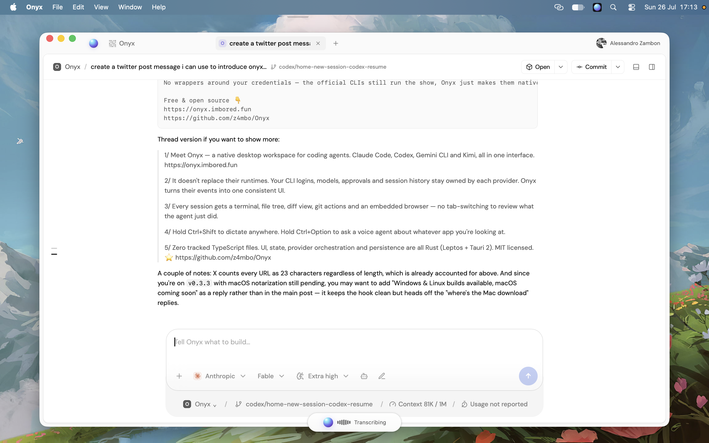

<p align="center">
  
</p>

<h1 align="center">Onyx</h1>

<p align="center">
  A Rust-first desktop workspace for coding agents, voice, Git, and local tools.
</p>

<p align="center">
  <a href="CHANGELOG.md"></a>
  
  
  <a href="LICENSE"></a>
</p>

Onyx gives Claude Code, Codex, Gemini CLI, and Kimi Code a consistent graphical workspace without replacing their official runtimes. Provider credentials, configuration, model availability, approvals, and session continuity remain owned by each installed CLI; Onyx turns their events into one native interface.

> Onyx is independent and is not affiliated with or endorsed by OpenCode, T3 Tools, Anthropic, OpenAI, Google, Moonshot AI, xAI, or OpenRouter.

<p align="center">
  
</p>

## Onyx 0.3.3

| Area | What changed |
| --- | --- |
| Home | Opens on the real Home screen. Projects can be removed along with the sessions they hold. |
| Sessions | Unnamed sessions take their title from the first prompt, the way the CLIs do. Right-click a tab to rename or delete it; closing a tab never deletes history. |
| Commands | A slash palette replaces the CLI launcher. `/model`, `/effort`, `/usage`, `/rename` and the rest run Onyx's own action; commands that are prompt-level in a provider's protocol are forwarded as written. |
| Conversation | Finished tool steps collapse into one row while the running step stays in view. Shell commands and fenced code are syntax highlighted. |
| Steering | Sending during a turn queues the message in a bar above the composer; ⌘↵ steers the running turn on Codex and Claude. |
| Navigation | Every prompt gets a rail marker that magnifies under the pointer; click to jump back. |
| Workspace | Terminal, Files, Diff, Browser and Git actions live in panels you can drag to resize. |
| Voice | Dictation, agent, speech, and voice choices are dropdowns; retired TTS defaults migrate to a current model. |
| Privacy | No accounts, no sign-in, no telemetry. |

## How it is built

| Layer | Implementation |
| --- | --- |
| Interface and application state | Rust, Leptos, and WebAssembly in `frontend-rs/src/` |
| Desktop shell and backend | Rust and Tauri 2 in `src-tauri/src/` |
| CLI providers and terminal lifecycle | Rust processes, normalized events, bounded output, and process-group cleanup |
| Webview integration | A small `frontend-rs/runtime.js` bridge for Tauri browser APIs, audio capture, and lazy-loaded xterm |

There are **zero tracked TypeScript files**. Onyx is not literally JavaScript-free: WebAssembly boot code, a narrow WebView runtime bridge, and xterm use the JavaScript ecosystem where the platform requires it. Application screens, session state, provider orchestration, persistence, permissions, and update logic remain in Rust.

## Providers

| Provider | Path | Authentication |
| --- | --- | --- |
| Codex | Official `codex app-server` session | Existing Codex login |
| Claude Code | Installed `claude` CLI | Existing Claude login |
| Gemini | Installed `gemini` CLI | Existing Gemini login |
| Kimi Code | Official `kimi acp` session, with bounded CLI fallback | Existing Kimi login |
| OpenRouter | Native Rust HTTP client and approved tool loop | API key stored in the OS credential manager |
| OpenAI audio | Native transcription and speech routes | API key stored in the OS credential manager |

Onyx does not install CLIs or take ownership of their logins. Official provider websites keep their own signed-in WebView sessions and are not merged into the native API chat.

## Core experience

- Project-grouped sessions with provider, model, reasoning, access, and Build/Plan controls.
- Streaming command output, FIFO follow-up queue, native steering where supported, stop/interrupt, approvals, and structured provider questions.
- Embedded official CLI sessions for native commands plus per-provider update actions.
- A prompt rail for long conversations with hover previews and click-to-jump navigation.
- Bottom terminal tabs and right-panel Chat, Browser, Files, Terminal, and Diff surfaces.
- Official provider chats in internal session webviews, plus native transcription and speech routes for Voice.
- Local-first history for sessions, voice, and preferences, with optional authenticated sync.
- A tray launcher that keeps global voice shortcuts available when the main window is hidden.

### Voice

| Gesture | Result |
| --- | --- |
| Hold `Control+Shift` | Record, transcribe, and insert dictation into the focused app |
| Hold `Control+Option` | Ask the configured voice agent about the active app |

The Voice settings select four independent roles: **Dictation model**, **Agent model**, **Speech model**, and **Voice**. Agent answers are read aloud only when **Speak responses** is enabled.

macOS requires Microphone, Input Monitoring, and Accessibility permissions for the full global-shortcut and text-insertion flow. Windows uses `Ctrl+Shift` and `Ctrl+Alt`. Linux currently exposes the Voice interface but does not install the global modifier-only listener.

## Run locally

Prerequisites:

- Current stable Rust with the `wasm32-unknown-unknown` target
- Node.js 22 and npm
- Trunk `0.21.14`
- [Tauri 2 prerequisites](https://v2.tauri.app/start/prerequisites/) for the host OS
- At least one supported CLI, or an OpenRouter/OpenAI API key for the native routes

```sh
git clone https://github.com/z4mbo/Onyx.git
cd Onyx
rustup target add wasm32-unknown-unknown
cargo install trunk --version 0.21.14 --locked
npm ci
npm run dev
```

`npm run dev:web` serves the same Rust/Leptos interface in a browser for rendering diagnostics; native Tauri commands are unavailable there.

### Verification

```sh
npm run typecheck
npm test
npm run build
cargo fmt --manifest-path frontend-rs/Cargo.toml -- --check
cargo fmt --manifest-path src-tauri/Cargo.toml -- --check
cargo clippy --manifest-path frontend-rs/Cargo.toml --target wasm32-unknown-unknown -- -D warnings
cargo clippy --manifest-path src-tauri/Cargo.toml --all-targets -- -D warnings
```

## Data and accounts

Onyx has no account system and no telemetry. There is nothing to sign in to: it
opens straight into the workspace.

Everything lives on your machine. Sessions, voice history, and preferences are
written under the Tauri app data directory; provider logins stay with the
official CLIs, and OpenRouter/OpenAI keys go to the OS credential manager.

## macOS releases

macOS release artifacts are built **only on a trusted local Mac**:

```sh
npm run release:macos:local
```

[`scripts/release-macos-local.sh`](scripts/release-macos-local.sh) requires:

- a Tauri updater signing key through `TAURI_SIGNING_PRIVATE_KEY` or `TAURI_SIGNING_PRIVATE_KEY_PATH`;
- a declared `TAURI_SIGNING_PRIVATE_KEY_PASSWORD`;
- an installed **Developer ID Application** identity in `APPLE_SIGNING_IDENTITY`;
- either App Store Connect API credentials or Apple ID notarization credentials;
- both Apple targets for the default universal build, or an explicit `ONYX_MACOS_TARGET`.

With Tauri CLI 2.11, the build wrapper safely maps
`TAURI_SIGNING_PRIVATE_KEY_PATH` to the path-valued
`TAURI_SIGNING_PRIVATE_KEY` variable consumed by `tauri build`; it never reads
or prints the private key contents. Set `ONYX_NOTARIZATION_TIMEOUT` to override
the bounded `30m` notarization wait.

The script builds and signs the app, explicitly submits the DMG to Apple,
requires an `Accepted` result, staples and validates its ticket, and only then
runs the Gatekeeper checks. Artifacts remain under
`src-tauri/target/<target>/release/bundle/`. The command deliberately does not
upload or publish anything.

Pushing the matching `v0.3.3` tag builds the Windows updater in a draft
GitHub release. After that draft exists, publish the already-verified local
macOS artifacts with:

```sh
npm run release:macos:publish -- --target universal-apple-darwin
```

[`scripts/publish-macos-release.sh`](scripts/publish-macos-release.sh) refuses
dirty or mismatched source trees, requires the Windows manifest and provenance
in the draft, validates every updater signature, preserves existing non-macOS
entries, merges the Darwin targets into `latest.json`, uploads the artifacts,
and publishes only after the complete manifest verifies. Use `--dry-run` to
exercise validation without changing GitHub.

The maintainer machine does not currently have the Developer ID Application identity and notarization setup needed for a Gatekeeper-trusted public build. The script therefore stops instead of presenting an ad-hoc development artifact as a production release.

GitHub Actions runs checks and creates Windows/Linux desktop bundles. Tagged release automation is Windows-only; macOS is intentionally absent from CI.

## Updates and current distribution status

Onyx uses Tauri's signed updater. When a newer version is reachable, an **Update** button appears in the title bar, and installation shows progress plus release notes before restart. Every updater archive must match the public key embedded in `src-tauri/tauri.conf.json`.

The configured endpoint is:

```text
https://github.com/z4mbo/Onyx/releases/latest/download/latest.json
```

The repository and its Releases endpoint are public, so installed copies can
read this URL without a GitHub login. The endpoint starts serving updates as
soon as the first complete release publishes `latest.json`; until then GitHub
correctly returns `404`.

The local build and publish commands provide the complete signed-release path.
A valid Developer ID identity and notarization credentials are still required
before publishing a Gatekeeper-trusted macOS update.

## Security notes

- Coding agents and terminals can edit files and execute programs. Work in Git and review changes.
- CLI credentials and configuration stay with the official provider tools.
- OpenRouter and OpenAI API keys are validated and stored in the OS credential manager, never returned to the WebView.
- OpenRouter file tools are constrained to the canonical workspace; mutations require explicit Rust-side approval.
- Local session JSON is not encrypted. It never leaves your machine.
- Internal browser panels load third-party websites; their terms, privacy policies, and authentication rules still apply.

## Screenshots

<p align="center">
  
</p>

<p align="center"><em>Home stays focused on projects, searchable sessions, and one-click creation.</em></p>

<p align="center">
  
</p>

<p align="center"><em>Native Rust settings with separate dictation, agent, speech, and voice selectors.</em></p>

## Attribution and license

Onyx's visual language references the MIT-licensed OpenCode UI at [`411eff73f026d4950c07947c4d983788cb615baa`](https://github.com/anomalyco/opencode/tree/411eff73f026d4950c07947c4d983788cb615baa). Provider separation, persistent-session behavior, composer controls, and workspace interactions were informed by T3 Code at [`78a0ea55c1d9edce8bcd2b3caff9510b4093e6d3`](https://github.com/pingdotgg/t3code/tree/78a0ea55c1d9edce8bcd2b3caff9510b4093e6d3).

Onyx does not ship T3 Code as a runtime dependency and does not redistribute upstream brands or logos. Complete pinned provenance and license texts are preserved in [THIRD_PARTY_NOTICES.md](THIRD_PARTY_NOTICES.md) and [`licenses/`](licenses/).

Onyx is released under the [MIT License](LICENSE).
