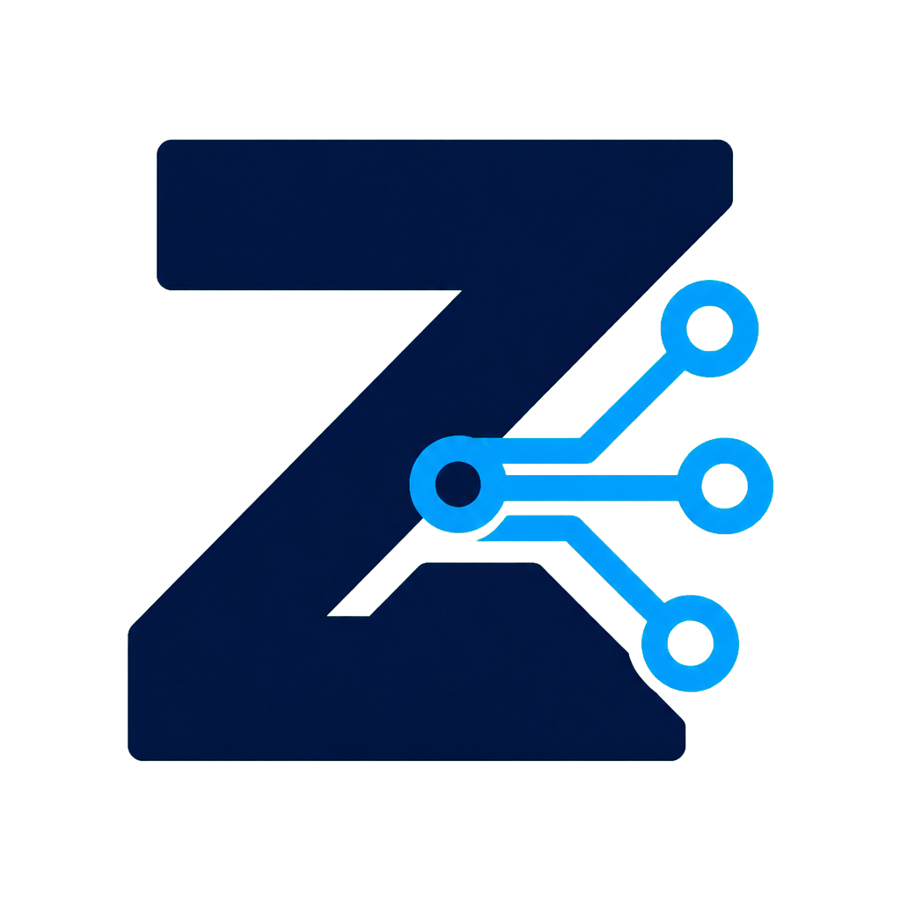

<p align="center">
  
</p>

<h1 align="center">zAI</h1>

<p align="center">
  A cross-platform desktop workspace for AI coding assistants and OpenRouter models.
</p>

<p align="center">
  <a href="https://github.com/z4mbo/zAI/releases/latest"></a>
  <a href="LICENSE"></a>
  
  
</p>

zAI puts project files, split terminals, chat views, Git, reusable skills and agents, and Model Context Protocol (MCP) connections in one desktop app. It can launch locally installed Claude Code, Gemini CLI, Codex CLI, and Kimi Code. OpenRouter appears as a selectable zAI engine profile and executes through the official Kimi Code CLI, so one OpenRouter key can be used with a compatible model chosen from its catalog.

> zAI is a desktop client, not a model subscription. The CLI or provider you select may require its own account, API key, and usage charges.

## Features

- **Five choices in one workspace:** Claude, Gemini, Codex, Kimi Code, and OpenRouter through Kimi Code.
- **OpenRouter model selection:** connect a key, load the authenticated catalog of tool-capable models, and choose the model used for new OpenRouter sessions.
- **Up to four terminals:** split project work across independent AI or shell sessions.
- **Project workspace:** file tree, project switching, imported folders, per-project instructions, skills, and agents.
- **Git without leaving the app:** inspect changes and run common repository operations.
- **MCP connections:** the shared `.mcp.json` is synchronized for Gemini and Kimi Code, including zAI's bundled GUI-control server.
- **Windows and macOS releases:** Windows 11 x64 NSIS installer plus macOS DMG and ZIP builds for Intel and Apple silicon.
- **User-owned files:** packaged builds create projects in `Documents/zAI Projects`, not beside the executable or inside an app bundle.

## Install

Download the appropriate artifact from [GitHub Releases](https://github.com/z4mbo/zAI/releases/latest).

### Windows 11

1. Download `zAI-<version>-win-x64.exe`.
2. Run the installer and choose an install location.
3. If Microsoft Defender SmartScreen appears on an unsigned development release, verify that the file came from this repository before choosing **More info → Run anyway**.

### macOS

1. Download the `arm64` DMG for Apple silicon (M1 or later), or the `x64` DMG for an Intel Mac.
2. Open the DMG and drag zAI to **Applications**. The ZIP contains the same app without the DMG wrapper.
3. Releases built without an Apple Developer certificate are not notarized. After verifying the download, macOS users can Control-click zAI, choose **Open**, and confirm once. Properly signed and notarized releases open normally.

The release workflow supports signing and notarization when the repository's Apple certificate and notarization secrets are configured. Updates are installed manually from GitHub Releases; while this repository is private, downloading a release requires an authorized GitHub account. This avoids embedding a private-repository access token in desktop builds and keeps the Intel and Apple-silicon packages unambiguous.

## Set up an assistant

Install at least one supported CLI and complete that tool's login or API-key setup. Restart zAI after installation so it can detect the executable on `PATH`.

- [Claude Code](https://docs.anthropic.com/en/docs/claude-code)
- [Gemini CLI](https://github.com/google-gemini/gemini-cli)
- [Codex CLI](https://github.com/openai/codex)
- [Kimi Code](https://www.kimi.com/code/docs/en/kimi-code-cli/guides/getting-started.html)

Kimi Code's official installers are:

```powershell
# Windows PowerShell
irm https://code.kimi.com/kimi-code/install.ps1 | iex
```

```bash
# macOS
curl -fsSL https://code.kimi.com/kimi-code/install.sh | bash

# Alternative when Node.js 22.19+ is already installed
npm install -g @moonshot-ai/kimi-code
```

Verify the installation with `kimi --version`, then run `kimi` once to sign in. OpenRouter integration requires Kimi Code 0.6.0 or newer. On Windows, Kimi Code also requires Git for Windows; see its official setup guide if Git Bash is installed in a custom location.

### OpenRouter

OpenRouter sessions run through Kimi Code, so install Kimi Code 0.6.0 or newer first.

1. Create a key in [OpenRouter settings](https://openrouter.ai/settings/keys).
2. In zAI, open **Settings → Providers → OpenRouter** and enter the key.
3. Refresh the model list and choose a model. OpenRouter model IDs use the `provider/model` form shown in the [model catalog](https://openrouter.ai/models).
4. Start a new terminal and select **OpenRouter**. Existing terminals retain the configuration with which they were launched.

Treat an OpenRouter key like a password. Electron encrypts it locally with the operating system's `safeStorage`; the renderer and settings UI never receive the plaintext after saving. zAI fetches compatible choices from OpenRouter's authenticated `/api/v1/models/user` endpoint and injects temporary `KIMI_MODEL_*` environment variables only into that OpenRouter terminal's local process tree. Replacing or disconnecting the key terminates active OpenRouter terminals. A same-user process inspector, an inherited child process, or a compromised machine can still expose a running process's environment, so do not paste keys into project instructions, MCP configuration, screenshots, issues, or logs. Prefer a dedicated key with a spending limit, and revoke it immediately if it is exposed. Model pricing and data policies vary by provider, so review them before selecting a model.

## Projects and MCP configuration

Packaged zAI builds store managed projects here:

- Windows: `%USERPROFILE%\Documents\zAI Projects`
- macOS: `~/Documents/zAI Projects`

On first access, zAI copies projects found in older install-adjacent or legacy application-data locations. Migration never deletes the old copy and never overwrites a same-named project in the new location. Review and remove an old copy manually only after confirming the migrated project works.

Each project's shared MCP list lives in `.mcp.json`. zAI also preserves unrelated settings while synchronizing that list to:

- `.gemini/settings.json` for Gemini CLI; and
- `.kimi-code/mcp.json` for current Kimi Code releases.

Project-level MCP servers and `canvas.html` are active content. Only open projects and enable MCP servers that you trust. Canvas file access is confined to the active project; Canvas scripts cannot write to OpenRouter terminals and can only prefill other terminals without pressing Enter.

## Development

### Prerequisites

- Node.js 22.19 or newer
- npm and Git
- Windows 11 with Visual Studio Build Tools, or macOS with Xcode Command Line Tools, when `node-pty` must compile locally

```bash
git clone https://github.com/z4mbo/zAI.git
cd zAI
npm install
npm run rebuild
npm run dev
```

Useful commands:

| Command | Purpose |
|---|---|
| `npm run dev` | Run zAI with hot reload |
| `npm run typecheck` | Check main, preload, and renderer TypeScript |
| `npm test` | Run Node's test runner |
| `npm run build` | Build the Electron application into `out/` |
| `npm run rebuild` | Rebuild native dependencies for Electron |
| `npm run build:win` | Build the Windows 11 x64 NSIS installer |
| `npm run build:mac:x64` | Build Intel macOS DMG and ZIP artifacts |
| `npm run build:mac:arm64` | Build Apple-silicon macOS DMG and ZIP artifacts |
| `npm run build:mac` | Build both macOS architectures on a capable Mac |

Native packages must be built on the target operating system and architecture. The GitHub Actions workflow uses native Windows x64, macOS arm64, and macOS Intel runners. Push a tag such as `v0.2.0` to verify, package, and publish all three release variants. The workflow publishes installers only; it intentionally does not publish auto-update metadata for the private repository.

## Architecture

zAI uses Electron's main/preload/renderer separation:

```text
src/
├── main/          Electron lifecycle, PTYs, engines, projects, Git, files, MCP
├── preload/       narrow contextBridge IPC API
└── renderer/      React UI, xterm.js terminals, Zustand stores

resources/
├── default-projects/   bundled skills, agents, and GUI-control MCP server
└── installer/          Windows NSIS artwork and copy
```

The terminal process uses `node-pty`, so the packaged native module must match the target Electron architecture. The GUI-control MCP server uses the packaged Electron executable in Node mode, avoiding a separate Node.js runtime requirement for that bundled server.

## License and upstream credit

zAI is free software under the [GNU General Public License v3.0](LICENSE). It is a modified fork of Bruno Pigat's [friendly-terminal](https://github.com/BrunoPigat/friendly-terminal). Original authors retain copyright in their work; later contributors retain copyright in their modifications. See [ATTRIBUTION.md](ATTRIBUTION.md) for the modification notice.

This fork is independently maintained and is not affiliated with or endorsed by the upstream project, Anthropic, Google, OpenAI, Moonshot AI, or OpenRouter.
